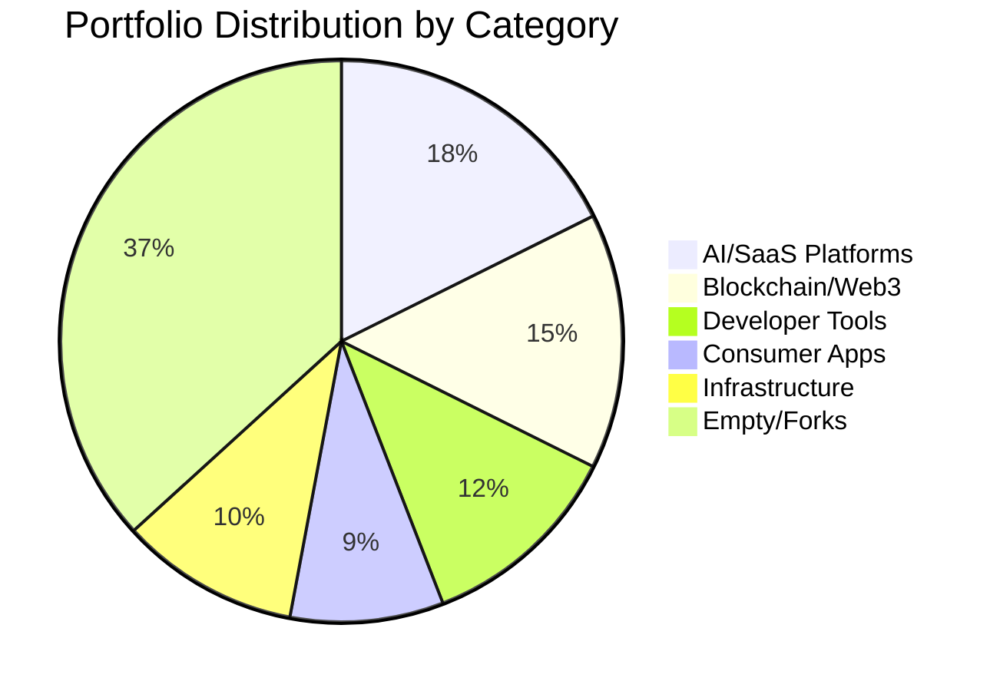
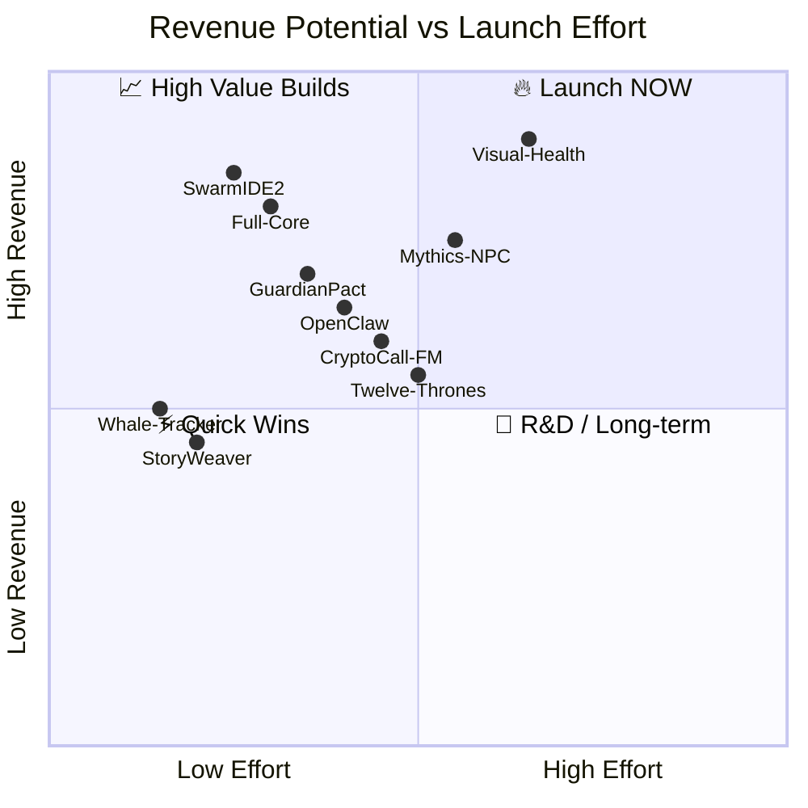
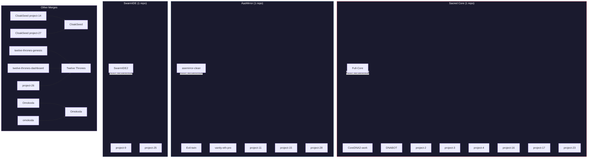

# 🏢 Bino-Elgua Portfolio — Enterprise Analysis Report

> **Generated:** March 14, 2026  
> **Total Projects Scanned:** 63 unique projects (+ 33 numbered variants)  
> **Active Codebases:** 38 | **Empty/Abandoned:** 25  
> **Estimated Portfolio Value:** $2M–$8.5M (Year 1–3)

---

## 📊 Executive Summary

This portfolio contains **63 distinct project directories** spanning AI/SaaS platforms, blockchain protocols, developer tools, consumer apps, and infrastructure. After deep analysis:

- **6 projects** are **launch-ready** with monetization already built (Stripe, on-chain fees, subscriptions)
- **10 projects** need **minor work** (1–4 weeks) to become revenue-generating
- **22 projects** are **active prototypes** with strong IP value
- **25 projects** are **empty, abandoned, duplicates, or forks** — recommended for cleanup

### Portfolio at a Glance

| Metric | Count |
|--------|-------|
| 🟢 Launch-Ready (Tier 1) | 6 |
| 🟡 Near-Ready (Tier 2) | 10 |
| 🔶 WIP/Prototypes (Tier 3) | 22 |
| 🔴 Empty/Abandoned (Tier 4) | 25 |
| **Projects with Stripe** | 4 |
| **Projects with on-chain revenue** | 8 |
| **Projects with token economics** | 6 |
| **Unique tech stacks** | 15+ |

---

## 🗺️ Portfolio Heat Map

```
PROJECT STATUS MATRIX
═══════════════════════════════════════════════════════════════
                    MONETIZATION READINESS →
                    None    Planned   Built    Live
                    ─────   ───────   ─────    ────
  COMPLETE    ▐     Paradigm  OpenClaw  Full-Core  ▐  ★★★
  (Production) ▐    IfaScript           SwarmIDE2  ▐
              ▐     Ghost-Mod           WhaleTrack ▐
              ▐                         StoryWeav  ▐
              ▐                         12Thrones  ▐
  ────────────▐─────────────────────────────────────▐────────
  FUNCTIONAL  ▐  NarratorIDE GuardPact  MechPro    ▐  ★★
  (Near-ready) ▐  Nex        VisHealth  Mythics    ▐
              ▐  Paradigm    WorldDutch CryptoCFM  ▐
              ▐              CloakSeed  CoreDNA2   ▐
  ────────────▐─────────────────────────────────────▐────────
  PROTOTYPE   ▐  Swibe       OSOVM      Leo        ▐  ★
  (WIP)       ▐  Omokoda     AIO        OClaw-Bot  ▐
              ▐  TechGnosis  Scarab                ▐
              ▐  Zangbeto    BIPON39                ▐
  ────────────▐─────────────────────────────────────▐────────
  EMPTY       ▐  25 projects (see Tier 4)          ▐  ✗
═══════════════════════════════════════════════════════════════
```

---

## 🏆 Tier Rankings

### 🥇 TIER 1 — LAUNCH-READY (Revenue Systems Built)

| # | Project | Stack | Revenue Model | Est. MRR | Files |
|---|---------|-------|---------------|----------|-------|
| 1 | **Full-Core** (Sacred Core v2) | React 19/Fastify/Stripe | Stripe subscriptions + credits + affiliate | $5K–$25K | 167 |
| 2 | **SwarmIDE2** | React 19/Supabase/Stripe | Free/$29mo/$299mo SaaS tiers | $10K–$50K | 129 |
| 3 | **Whale-Tracker** | Python/Discord/Stripe | $19/mo Pro + $99/mo API | $3K–$15K | 26 |
| 4 | **StoryWeaver** | Svelte/Flask/Stripe | $0.99/book + $4/mo sub | $2K–$10K | 41 |
| 5 | **CryptoCall-FM** (Seemplify) | TS/Solana | Token burns + creator rewards | $5K–$30K | 91 |
| 6 | **Twelve-Thrones-Genesis** | TS/Express/Sui Move | NFT minting + Arweave archival | $1K–$8K | 60 |

### 🥈 TIER 2 — NEAR-READY (1–4 Weeks to Launch)

| # | Project | What's Missing | Est. Effort | Potential MRR |
|---|---------|----------------|-------------|---------------|
| 7 | **CoreDNA2-work** | Stripe integration | 1 week | $5K–$20K |
| 8 | **GuardianPact** | Pricing tiers + auth | 2 weeks | $3K–$15K |
| 9 | **Mythics-NPC-Forge** | Real Sui transactions | 2 weeks | $2K–$12K |
| 10 | **Health_Companion** (Mechanic Pro) | Firebase setup + testing | 3 weeks | $4K–$20K |
| 11 | **Visual-Health-Companion** | Backend + Stripe | 4 weeks | $8K–$35K |
| 12 | **World-Dutch-Auctions** | Mainnet deploy + audit | 3 weeks | $2K–$10K |
| 13 | **OpenClaw** | Marketing + hosting | 2 weeks | $5K–$25K |
| 14 | **Trinity-Genesis** | Payment layer | 2 weeks | $3K–$15K |
| 15 | **Twelve-Thrones-Dashboard** | Connect to genesis backend | 1 week | (bundled w/ #6) |
| 16 | **CloakSeed** | Payment gate | 1 week | $1K–$5K |

### 🥉 TIER 3 — WIP/PROTOTYPES (Strong IP, Needs Development)

| # | Project | Category | Value Proposition |
|---|---------|----------|-------------------|
| 17 | DNABOT | AI SaaS | Consolidate → Full-Core |
| 18 | NarratorIDE | Dev Tool | Unique code narration concept |
| 19 | Nex | Runtime | Agent-native language (research) |
| 20 | Swibe | Language | Sovereign agent scripting |
| 21 | Leo | Trading | AI recursive crypto strategies |
| 22 | Paradigm | AI Core | 10-paradigm consciousness system |
| 23 | OSOVM | VM | Sacred virtual machine (160 opcodes) |
| 24 | Omokoda | Agent | 11-lobe agentic organism |
| 25 | TechGnosis | Language | Yoruba-inspired smart contract lang |
| 26 | OpenClaw-Bot | Trading | Multi-signal Fibonacci trading bot |
| 27 | Vibe-Coder-Pantheon | Dev Tool | 21-agent code generation |
| 28 | Zangbeto | Security | Ritual-driven smart contract audit |
| 29 | ScarabSwarm | Sim | Drone racing + blockchain proofs |
| 30 | AIO | DeFi | On-chain governance + oracle |
| 31 | IfaScript | Language | Divination-as-computation VM |
| 32 | Ghost-Modules | DevOps | Bash automation toolkit |
| 33 | Witness-Firmware | IoT | LoRa DePIN attestation |
| 34 | Organism-Core | Infra | Technosis ecosystem bridge |
| 35 | OSO-Control-Center | Admin | OSOVM management dashboard |
| 36 | BIPON39 | Crypto | Sacred HD wallet derivation |
| 37 | Franken-Stream | Media | Streaming search aggregator |
| 38 | Arcane-Realms (project-10) | Gaming | AI Dungeon Master |

### ❌ TIER 4 — EMPTY/ABANDONED/FORKS (25 Projects)

<details>
<summary>Click to expand full list</summary>

| Project | Status |
|---------|--------|
| Amp_repo (root) | Empty shell |
| Arcane-Realms (root) | Empty (2 files) |
| Cassandra | Empty |
| Clip-Forge | Empty |
| CloakSeed (root) | Empty |
| Echo-Companion | Empty |
| Sonic-Brand-AI | Empty |
| Studio-Suite | Source deleted |
| Twelve-Thrones | Empty |
| Vanity-Eth-Pro-Custom | Empty |
| Whale-Tracker-Pro | Empty |
| Vibe-Coder | Empty |
| Vibe-Lang | Concept only |
| Ghost-Notes | Stub |
| Ghost-Repos | Data dir |
| Ghost-Swarm | Stub |
| Ghost-Modules-Dev | Duplicate |
| Asemirror | Data file |
| BIPON39-Diamond | Scaffold |
| llama.cpp | Upstream clone |
| Franken-Agent | Fork (Open Interpreter) |
| Dify | 3rd party fork |
| Evil-Twin | Duplicate |
| Vanity-Eth-Pro | Duplicate |
| Kels-Braids | Simple business site |

</details>

---

## 📈 Category Breakdown



### AI/SaaS Platforms (12 projects)
| Project | Monetization Model | Readiness |
|---------|-------------------|-----------|
| Full-Core | Stripe SaaS + Credits | 🟢 Ready |
| SwarmIDE2 | Tiered SaaS ($29/$299) | 🟢 Ready |
| CoreDNA2-work | SaaS (needs Stripe) | 🟡 Near |
| DNABOT | SaaS variant | 🔶 Consolidate |
| GuardianPact | Contract analysis SaaS | 🟡 Near |
| ScribeMirror | Story generation BYOK | 🟢 Ready |
| NarratorIDE | Code narration tool | 🔶 WIP |
| Paradigm | AI reasoning engine | 🔶 WIP |
| Vibe-Coder-Pantheon | 21-agent code gen | 🔶 WIP |
| OpenClaw | Personal AI assistant | 🟡 Near |
| StoryWeaver | AI book creation | 🟢 Ready |
| Visual-Health-Companion | Fitness SaaS | 🟡 Near |

### Blockchain/Web3 (10 projects)
| Project | Chain | Revenue Mechanism |
|---------|-------|-------------------|
| Twelve-Thrones-Genesis | Sui | NFT minting + Arweave |
| CryptoCall-FM | Solana | Token economy |
| World-Dutch-Auctions | World Chain | 5% auction fee |
| Mythics-NPC-Forge | Sui | NFT marketplace |
| OSOVM | Multi-chain | Àṣẹ token economics |
| AIO | Sui | Oracle bonds + escrow |
| Omokoda | Sui | On-chain treasury |
| BIPON39 | Multi-chain | 1440 wallet derivation |
| Zangbeto | Sui | Bug bounty protocol |
| TechGnosis | Multi-chain | 3.69% tithe system |

### Developer Tools (8 projects)
| Project | Type | Unique Value |
|---------|------|-------------|
| SwarmIDE2 | Multi-agent IDE | Conflict resolution + cost tracking |
| Swibe | Agent language | Sovereign identity primitives |
| Nex | Agent runtime | Graph-based computation |
| IfaScript | Esoteric VM | 256-opcode divination VM |
| Ghost-Modules | Shell automation | Modular bash toolkit |
| Franken-Stream | Media search | Streaming aggregator |
| Organism-Core | Bridge | Technosis ecosystem glue |
| OSO-Control-Center | Dashboard | OSOVM management |

### Consumer Apps (6 projects)
| Project | Platform | Revenue |
|---------|----------|---------|
| Whale-Tracker | Discord/Telegram | $19–$99/mo Stripe |
| GamerWingman | Android (Unity) | $4.99/mo IAP |
| Health_Companion | Flutter (Android) | Stripe job billing |
| Visual-Health-Companion | Web (Next.js) | $14.99–$29.99/mo |
| Kels-Braids | Web | Business booking |
| Arcane-Realms | Web | Freemium gaming |

---

## 🎯 Top 10 Monetization Candidates



### Ranked by ROI Score (Revenue ÷ Effort)

| Rank | Project | Revenue Potential | Effort to Launch | ROI Score | Est. Y1 Revenue |
|------|---------|-------------------|------------------|-----------|-----------------|
| 🥇 1 | **SwarmIDE2** | ★★★★★ | ★★☆☆☆ | **9.5/10** | $120K–$600K |
| 🥈 2 | **Full-Core** | ★★★★★ | ★★☆☆☆ | **9.0/10** | $60K–$300K |
| 🥉 3 | **Whale-Tracker** | ★★★☆☆ | ★☆☆☆☆ | **8.5/10** | $36K–$180K |
| 4 | **StoryWeaver** | ★★★☆☆ | ★☆☆☆☆ | **8.0/10** | $24K–$120K |
| 5 | **GuardianPact** | ★★★★☆ | ★★☆☆☆ | **7.5/10** | $36K–$180K |
| 6 | **Visual-Health-Companion** | ★★★★★ | ★★★☆☆ | **7.0/10** | $96K–$420K |
| 7 | **OpenClaw** | ★★★★☆ | ★★☆☆☆ | **7.0/10** | $60K–$300K |
| 8 | **Mythics-NPC-Forge** | ★★★★☆ | ★★★☆☆ | **6.5/10** | $24K–$144K |
| 9 | **CryptoCall-FM** | ★★★★☆ | ★★★☆☆ | **6.5/10** | $60K–$360K |
| 10 | **Twelve-Thrones-Genesis** | ★★★☆☆ | ★★☆☆☆ | **6.0/10** | $12K–$96K |

---

## 🔄 Consolidation Recommendations

**You have 15+ duplicate/variant projects that should be merged into canonical repos:**



**Post-consolidation: 63 projects → ~30 unique repos**

---

## 💰 Revenue Projections

### Year 1 Scenarios

```
CONSERVATIVE (Launch Top 3 Only)
═══════════════════════════════════════════════════
SwarmIDE2       ████████████████████   $120K–$240K
Full-Core       ████████████████       $60K–$120K  
Whale-Tracker   ████████               $36K–$72K
                                       ──────────
TOTAL                                  $216K–$432K

MODERATE (Launch Top 8)
═══════════════════════════════════════════════════
SwarmIDE2       ████████████████████████  $240K–$480K
Full-Core       ████████████████████     $120K–$240K
GuardianPact    ████████████             $60K–$120K
Whale-Tracker   ████████████             $60K–$120K
StoryWeaver     ████████                 $36K–$72K
OpenClaw        ████████████             $60K–$120K
Visual Health   ████████████████         $96K–$180K
CryptoCall-FM   ████████████             $60K–$120K
                                         ──────────
TOTAL                                    $732K–$1.45M

AGGRESSIVE (Full Portfolio Activation)
═══════════════════════════════════════════════════
All Tier 1+2    ████████████████████████████  $1.2M–$2.5M
Blockchain rev  ████████████████             $300K–$800K
Token economics ████████████                 $200K–$500K
Licensing/API   ████████                     $100K–$300K
                                             ──────────
TOTAL                                        $1.8M–$4.1M
```

### Year 1–3 Growth Trajectory

| Year | Conservative | Moderate | Aggressive |
|------|-------------|----------|------------|
| **Y1** | $216K–$432K | $732K–$1.45M | $1.8M–$4.1M |
| **Y2** | $500K–$1M | $1.5M–$3M | $4M–$8.5M |
| **Y3** | $800K–$1.5M | $2.5M–$5M | $6M–$15M |

---

## 🚀 Launch Sequence — Action Plan

```mermaid
flowchart LR
    subgraph WEEK1["Week 1-2"]
        W1[🐋 Whale-Tracker<br/>Deploy to Railway<br/>Launch Discord bot]
        W2[📖 StoryWeaver<br/>Deploy Flask+Svelte<br/>Enable Stripe]
    end
    
    subgraph WEEK3["Week 3-4"]
        W3[🧠 SwarmIDE2<br/>Deploy to Vercel<br/>Activate billing]
        W4[⚡ Full-Core<br/>Deploy Fastify+React<br/>Stripe live mode]
    end
    
    subgraph MONTH2["Month 2"]
        M1[🛡️ GuardianPact<br/>Add auth + pricing]
        M2[🏋️ Visual Health<br/>Complete backend]
        M3[🔗 CryptoCall-FM<br/>Solana mainnet]
    end
    
    subgraph MONTH3["Month 3"]
        M4[👑 12-Thrones<br/>Sui mainnet deploy]
        M5[🎮 Mythics NPC<br/>Real Sui minting]
        M6[🐙 OpenClaw<br/>Marketing launch]
    end

    WEEK1 --> WEEK3 --> MONTH2 --> MONTH3

    style WEEK1 fill:#0d1117,stroke:#238636,color:#fff
    style WEEK3 fill:#0d1117,stroke:#1f6feb,color:#fff
    style MONTH2 fill:#0d1117,stroke:#f78166,color:#fff
    style MONTH3 fill:#0d1117,stroke:#a371f7,color:#fff
```



### Immediate Actions (This Week)

1. **Consolidate duplicates** — Merge Sacred Core variants into Full-Core repo
2. **Deploy Whale-Tracker** — Lowest effort, immediate Stripe revenue
3. **Deploy StoryWeaver** — Quick Stripe activation, compelling product
4. **SwarmIDE2 launch prep** — Verify billing, deploy to Vercel

### 30-Day Goals

- [ ] 4 products live with payment processing
- [ ] $1K+ MRR from Stripe subscriptions
- [ ] Consolidate 63 repos → 30 canonical repos
- [ ] Delete empty/abandoned projects

### 90-Day Goals

- [ ] 8 products generating revenue
- [ ] $5K–$15K MRR
- [ ] 2 blockchain products on mainnet
- [ ] Marketing site for portfolio

---

## 📁 Project Index

Each project has its own detailed report in the `/projects/` directory:

| # | Project | Report File |
|---|---------|------------|
| 1 | Amp_repo | [projects/01-amp-repo.md](projects/01-amp-repo.md) |
| 2 | CoreDNA2-work | [projects/02-coredna2-work.md](projects/02-coredna2-work.md) |
| 3 | DNABOT | [projects/03-dnabot.md](projects/03-dnabot.md) |
| 4 | Evil-twin | [projects/04-evil-twin.md](projects/04-evil-twin.md) |
| 5 | Full-Core | [projects/05-full-core.md](projects/05-full-core.md) |
| 6 | GamerWingman | [projects/06-gamerwingman.md](projects/06-gamerwingman.md) |
| 7 | GuardianPact | [projects/07-guardianpact.md](projects/07-guardianpact.md) |
| 8 | Kels-Braids | [projects/08-kels-braids.md](projects/08-kels-braids.md) |
| 9 | NarratorIDE | [projects/09-narratoride.md](projects/09-narratoride.md) |
| 10 | Nex | [projects/10-nex.md](projects/10-nex.md) |
| 11 | Omokoda | [projects/11-omokoda.md](projects/11-omokoda.md) |
| 12 | ScribeMirror | [projects/12-scribemirror.md](projects/12-scribemirror.md) |
| 13 | SwarmIDE2 | [projects/13-swarmide2.md](projects/13-swarmide2.md) |
| 14 | Swibe | [projects/14-swibe.md](projects/14-swibe.md) |
| 15 | AIO | [projects/15-aio.md](projects/15-aio.md) |
| 16 | Arcane-Realms | [projects/16-arcane-realms.md](projects/16-arcane-realms.md) |
| 17 | ÀṣẹVault | [projects/17-ase-vault.md](projects/17-ase-vault.md) |
| 18 | ÀṣẹMirror-Clean | [projects/18-asemirror-clean.md](projects/18-asemirror-clean.md) |
| 19 | BIPON39 | [projects/19-bipon39.md](projects/19-bipon39.md) |
| 20 | BlockRoots-USA | [projects/20-blockroots-usa.md](projects/20-blockroots-usa.md) |
| 21 | Cassandra | [projects/21-cassandra.md](projects/21-cassandra.md) |
| 22 | Clip-Forge | [projects/22-clip-forge.md](projects/22-clip-forge.md) |
| 23 | CloakSeed | [projects/23-cloakseed.md](projects/23-cloakseed.md) |
| 24 | CryptoCall-FM | [projects/24-cryptocall-fm.md](projects/24-cryptocall-fm.md) |
| 25 | Decentralized-Tournaments | [projects/25-decentralized-tournaments.md](projects/25-decentralized-tournaments.md) |
| 26 | Dify | [projects/26-dify.md](projects/26-dify.md) |
| 27 | Echo-Companion | [projects/27-echo-companion.md](projects/27-echo-companion.md) |
| 28 | Eternal-Orisa-Loom | [projects/28-eternal-orisa-loom.md](projects/28-eternal-orisa-loom.md) |
| 29 | Franken-Agent | [projects/29-franken-agent.md](projects/29-franken-agent.md) |
| 30 | Franken-Stream | [projects/30-franken-stream.md](projects/30-franken-stream.md) |
| 31 | Ghost-Modules | [projects/31-ghost-modules.md](projects/31-ghost-modules.md) |
| 32 | Health-Companion | [projects/32-health-companion.md](projects/32-health-companion.md) |
| 33 | IfaScript | [projects/33-ifascript.md](projects/33-ifascript.md) |
| 34 | Leo | [projects/34-leo.md](projects/34-leo.md) |
| 35 | Mythics-NPC-Forge | [projects/35-mythics-npc-forge.md](projects/35-mythics-npc-forge.md) |
| 36 | OpenClaw | [projects/36-openclaw.md](projects/36-openclaw.md) |
| 37 | OpenClaw-Bot | [projects/37-openclaw-bot.md](projects/37-openclaw-bot.md) |
| 38 | Organism-Core | [projects/38-organism-core.md](projects/38-organism-core.md) |
| 39 | OSO-Control-Center | [projects/39-oso-control-center.md](projects/39-oso-control-center.md) |
| 40 | OSOVM | [projects/40-osovm.md](projects/40-osovm.md) |
| 41 | Paradigm | [projects/41-paradigm.md](projects/41-paradigm.md) |
| 42 | Ritual-Codex | [projects/42-ritual-codex.md](projects/42-ritual-codex.md) |
| 43 | ScarabSwarm | [projects/43-scarabswarm.md](projects/43-scarabswarm.md) |
| 44 | Sonic-Brand-AI | [projects/44-sonic-brand-ai.md](projects/44-sonic-brand-ai.md) |
| 45 | StoryWeaver | [projects/45-storyweaver.md](projects/45-storyweaver.md) |
| 46 | Stream-Providers | [projects/46-stream-providers.md](projects/46-stream-providers.md) |
| 47 | Swibe-lowercase | [projects/47-swibe-lc.md](projects/47-swibe-lc.md) |
| 48 | TechGnosis | [projects/48-techgnosis.md](projects/48-techgnosis.md) |
| 49 | Trinity-Genesis | [projects/49-trinity-genesis.md](projects/49-trinity-genesis.md) |
| 50 | Twelve-Thrones-Dashboard | [projects/50-twelve-thrones-dashboard.md](projects/50-twelve-thrones-dashboard.md) |
| 51 | Twelve-Thrones-Genesis | [projects/51-twelve-thrones-genesis.md](projects/51-twelve-thrones-genesis.md) |
| 52 | Vanity-Eth-Pro | [projects/52-vanity-eth-pro.md](projects/52-vanity-eth-pro.md) |
| 53 | Vibe-Coder-Pantheon | [projects/53-vibe-coder-pantheon.md](projects/53-vibe-coder-pantheon.md) |
| 54 | Visual-Health-Companion | [projects/54-visual-health-companion.md](projects/54-visual-health-companion.md) |
| 55 | Whale-Tracker | [projects/55-whale-tracker.md](projects/55-whale-tracker.md) |
| 56 | Witness-Firmware | [projects/56-witness-firmware.md](projects/56-witness-firmware.md) |
| 57 | World-Dutch-Auctions | [projects/57-world-dutch-auctions.md](projects/57-world-dutch-auctions.md) |
| 58 | Zangbeto | [projects/58-zangbeto.md](projects/58-zangbeto.md) |
| 59 | GamerWingman (numbered) | [projects/59-gamerwingman-num.md](projects/59-gamerwingman-num.md) |
| 60 | Arcane-Realms (numbered) | [projects/60-arcane-realms-num.md](projects/60-arcane-realms-num.md) |
| 61 | CloakSeed (numbered) | [projects/61-cloakseed-num.md](projects/61-cloakseed-num.md) |
| 62 | BIPON39-Diamond | [projects/62-bipon39-diamond.md](projects/62-bipon39-diamond.md) |
| 63 | Eternal-Orisa-Loom-v8 | [projects/63-eternal-orisa-loom-v8.md](projects/63-eternal-orisa-loom-v8.md) |

---

## 🏁 Conclusion

This portfolio represents a **massive body of original IP** across AI, blockchain, and developer tooling. The key to unlocking revenue is **focus and consolidation**:

1. **Merge duplicates** (63 → 30 repos)
2. **Launch the 4 Stripe-ready products** within 2 weeks
3. **Deploy 2 blockchain products** to mainnet within 60 days
4. **Build a portfolio landing page** to showcase all products

The strongest immediate opportunities are **SwarmIDE2** (AI orchestration SaaS) and **Full-Core** (AI marketing platform) — both have Stripe billing built and could generate $10K+ MRR within 90 days of launch.

---

*Report generated by Amp AI Portfolio Analyzer — March 14, 2026*
