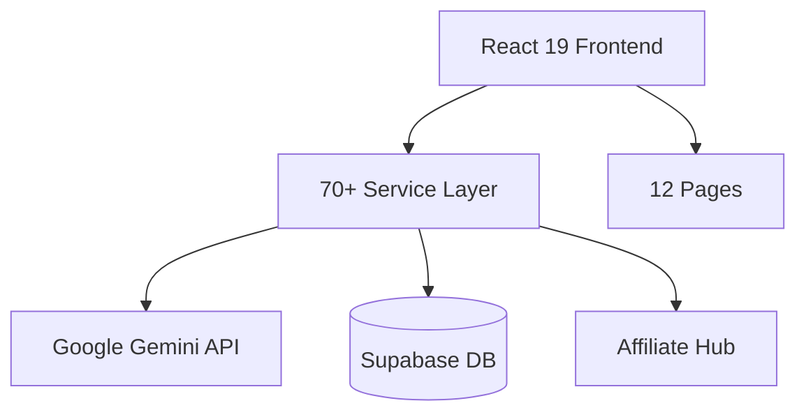

# CoreDNA2-work — Deep Dive Report

> **Category:** AI/SaaS Platform  
> **Status:** 🟡 Near-Ready  
> **Monetization:** 🟡 Affiliate only (no Stripe)  
> **Est. Y1 Revenue:** $60K–$240K

---

## Overview
AI-powered brand intelligence platform with brand DNA extraction, competitive analysis (battle mode), campaign generation, affiliate hub, sonic branding, site builder, scheduler, and portfolio management. 180 files across 12 pages and 90+ API providers.

## Tech Stack
- **Frontend:** React 19, TypeScript, Vite, Framer Motion, Recharts
- **Backend:** 70+ service files, API providers
- **Database:** Supabase
- **AI/ML:** Google Gemini API
- **Testing:** Playwright (E2E), html2canvas/jsPDF

## Architecture

## Monetization Analysis
### Current Revenue Mechanisms
- Affiliate system with 4 payout methods
- Video/image generation markup
- Usage-based billing model (documented, not implemented)

### Recommended Revenue Model
- Add Stripe integration (copy from Full-Core)
- Tiered SaaS: Free / Pro $29/mo / Enterprise $149/mo
- API access tier for agencies

### Revenue Projection
| Scenario | Monthly | Annual |
|----------|---------|--------|
| Conservative | $5K | $60K |
| Moderate | $10K | $120K |
| Aggressive | $20K | $240K |

## Competitive Landscape
- **Jasper AI** ($39-$125/mo) — AI marketing copy
- **Copy.ai** ($36-$186/mo) — Similar scope
- **Differentiation:** Brand DNA extraction, battle mode, 90+ providers

## Launch Requirements
- [ ] Integrate Stripe (borrow from Full-Core)
- [ ] Set up pricing tiers
- [ ] Deploy to Vercel/Railway
- [ ] Landing page with onboarding

## Risk Assessment
| Risk | Severity | Mitigation |
|------|----------|------------|
| Duplicate of Full-Core | High | Consolidate into one repo |
| No payment processing | Medium | Port Stripe from Full-Core |
| Crowded market | Medium | Focus on brand DNA niche |

## Verdict
Strong product but redundant with Full-Core. **Recommend consolidation** — merge best features into Full-Core. ⭐⭐⭐ (3/5)
