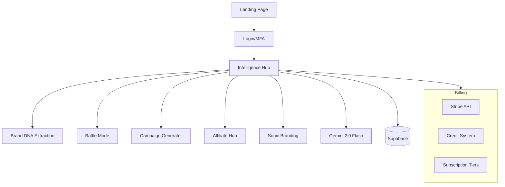

# Full-Core (Sacred Core v2) — Deep Dive Report

> **Category:** AI/SaaS Platform  
> **Status:** 🟢 Launch-Ready  
> **Monetization:** ✅ Stripe + Credits + Subscriptions  
> **Est. Y1 Revenue:** $60K–$300K

---

## Overview
The MOST COMPLETE variant of the Sacred Core enterprise AI marketing platform. Features Stripe billing, credit system, subscription management, Google-only setup, landing page, intelligence hub, and 24 pages. 167 files with production-grade security claims (WCAG AA, OWASP, SCIM 2.0, MFA).

## Tech Stack
- **Frontend:** React 19, TypeScript, Vite, Zustand
- **Backend:** Fastify server
- **Database:** Supabase, Firebase
- **AI/ML:** Google Gemini 2.0 Flash
- **Payments:** Stripe SDK
- **Testing:** Playwright, Artillery (load testing)
- **DevOps:** Docker, GitHub Actions

## Architecture

## Monetization Analysis
### Current Revenue Mechanisms
- ✅ **Stripe integration** — live payment processing
- ✅ **Credit system** — pay-as-you-go for AI generation
- ✅ **Subscription tiers** — Free/Pro/Enterprise
- ✅ **Pricing service** — dynamic cost calculation
- ✅ **Affiliate hub** — referral revenue sharing

### Revenue Projection
| Scenario | Monthly | Annual |
|----------|---------|--------|
| Conservative | $5K | $60K |
| Moderate | $15K | $180K |
| Aggressive | $25K | $300K |

## Competitive Landscape
- **Jasper AI** ($39-$125/mo) — 100K+ customers, $80M ARR
- **Copy.ai** ($36-$186/mo) — AI marketing suite
- **Differentiation:** Brand DNA extraction, battle mode analysis, credit system flexibility, 84 service integrations

## Launch Requirements
- [ ] Stripe live mode activation
- [ ] Supabase production database
- [ ] Deploy Fastify backend (Railway/Fly.io)
- [ ] Deploy React frontend (Vercel)
- [ ] DNS + SSL setup
- [ ] Onboarding email sequences

## Risk Assessment
| Risk | Severity | Mitigation |
|------|----------|------------|
| Competitive market | Medium | Focus on brand DNA niche |
| API costs (Gemini) | Medium | Credit system manages margins |
| Multiple Sacred Core variants | Low | Consolidate this as canonical |

## Verdict
**#2 highest ROI project in the portfolio.** Stripe billing is BUILT. Deploy within 2 weeks for immediate revenue. Absorb best features from DNABOT (Docker/CI) and CoreDNA2-work (90+ providers). ⭐⭐⭐⭐⭐ (5/5)
