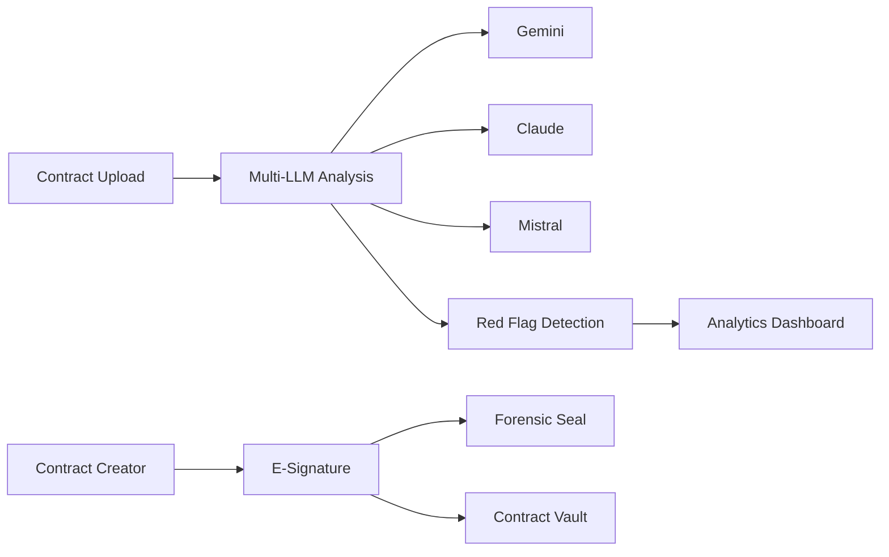

# GuardianPact — Deep Dive Report

> **Category:** AI/SaaS (Legal Tech)  
> **Status:** 🟡 Near-Ready  
> **Monetization:** ❌ None (easily addable)  
> **Est. Y1 Revenue:** $36K–$180K

---

## Overview
AI-powered contract analysis & creation tool. Upload contracts for multi-LLM red-flag detection, generate new contracts, e-signatures, forensic seals, and analytics dashboard. Supports 5 LLM providers (Gemini, Claude, Mistral, OpenAI, DeepSeek).

## Tech Stack
- **Frontend:** React 19, TypeScript, Vite
- **State:** Zustand
- **Validation:** Zod
- **AI/ML:** Gemini, Claude, Mistral, OpenAI, DeepSeek
- **Storage:** localStorage (needs upgrade to DB)

## Architecture

## Monetization Analysis
### Recommended Revenue Model
- **Free Tier:** 3 contracts/month, 1 LLM
- **Pro ($29/mo):** Unlimited contracts, all 5 LLMs, e-signatures
- **Enterprise ($99/mo):** Team accounts, API access, priority support

### Revenue Projection
| Scenario | Monthly | Annual |
|----------|---------|--------|
| Conservative | $3K | $36K |
| Moderate | $8K | $96K |
| Aggressive | $15K | $180K |

## Competitive Landscape
- **Ironclad** (Enterprise) — $50K+/year contracts
- **Juro** ($500+/mo) — Contract management
- **Differentiation:** Multi-LLM analysis (5 providers), BYOK model, affordable pricing, forensic seals

## Launch Requirements
- [ ] Add Stripe payment integration
- [ ] Migrate localStorage → Supabase
- [ ] Add auth (Firebase/Supabase Auth)
- [ ] Set up pricing tiers
- [ ] Deploy to Vercel

## Verdict
**High-value niche with low competition at this price point.** Legal tech is a $28B market. 2 weeks of work to add payments and auth makes this a top-5 revenue candidate. ⭐⭐⭐⭐ (4/5)
