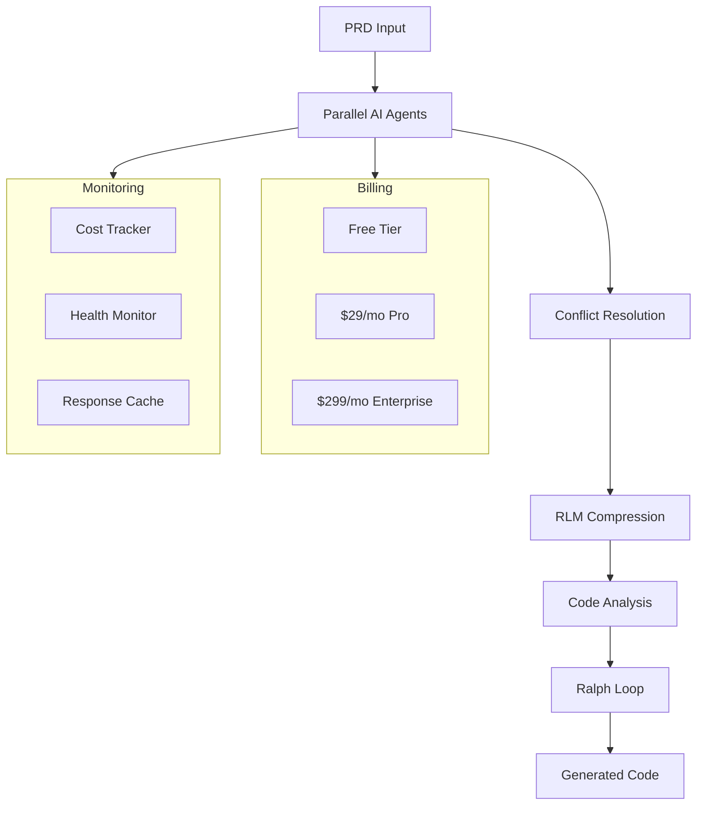

# SwarmIDE2 — Deep Dive Report
> **Category:** AI/SaaS Platform  
> **Status:** 🟢 Launch-Ready  
> **Monetization:** ✅ Full SaaS billing (Stripe, 3 tiers)  
> **Est. Y1 Revenue:** $120K–$600K

## Overview
Multi-agent AI orchestration platform — deploy parallel AI agents with conflict resolution, cost tracking, context compression, code analysis, and iterative PRD-driven execution. 129 files, 111/111 tests passing, production build exists.

## Tech Stack
- **Frontend:** React 19, TypeScript, Vite
- **Backend:** 51+ services, Socket.io
- **Database:** Supabase
- **AI/ML:** 6 LLM providers
- **Analytics:** D3.js, Langfuse
- **Testing:** Vitest (111 tests)
- **Payments:** Stripe

## Architecture

## Monetization Analysis
### Current Revenue Mechanisms
- ✅ Stripe billing service with customer mapping
- ✅ Three tiers: Free / Pro $29/mo / Enterprise $299/mo
- ✅ Per-token cost calculator
- ✅ Multi-tenancy with tenant billing + overages
- ✅ CostTracker.tsx UI component

### Revenue Projection
| Scenario | Monthly | Annual |
|----------|---------|--------|
| Conservative | $10K | $120K |
| Moderate | $25K | $300K |
| Aggressive | $50K | $600K |

## Competitive Landscape
- **CrewAI** (open source + cloud) — Multi-agent framework
- **AutoGen** (Microsoft, open source) — Agent orchestration
- **LangGraph** (LangChain) — Agent graphs
- **Differentiation:** Full SaaS with billing, conflict resolution, cost tracking UI, 7-phase architecture, 111 passing tests

## Launch Requirements
- [ ] Stripe live mode keys
- [ ] Supabase production instance
- [ ] Deploy to Vercel (frontend) + Railway (API)
- [ ] Landing page with pricing
- [ ] Documentation site

## Risk Assessment
| Risk | Severity | Mitigation |
|------|----------|------------|
| Fast-moving AI market | High | Rapid iteration, multi-LLM support |
| Enterprise sales cycle | Medium | Self-serve Pro tier first |
| API cost management | Low | Built-in cost tracking |

## Verdict
**#1 highest ROI project in the entire portfolio.** Complete SaaS with billing, 111 passing tests, and production build. Deploy within 1-2 weeks. Target $10K MRR within 90 days. ⭐⭐⭐⭐⭐ (5/5)
